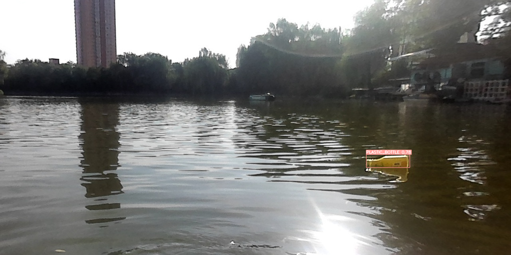
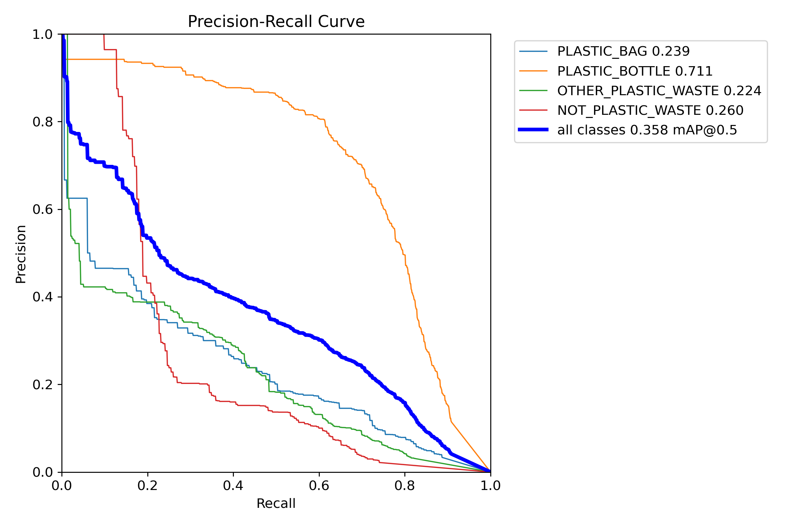
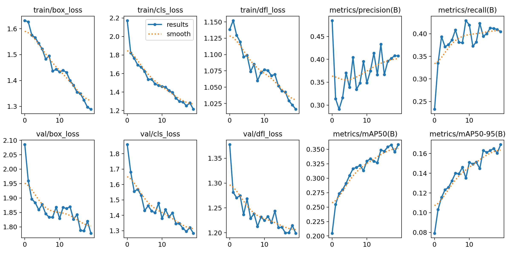

# Plastic-In-River-Detection

## Objective

Plastic pollution in marine environnement is a global threat. It threatens marine species health, human health, food security, costal tourism. More than 350 million tons of plastic are produced every year and it is estimated that more than 15 million tons end up in the world Ocean. The plastic then degrades over time into micro-plastic and both macro and microplastic have serious environmental impacts. Rivers are the very first source of plastic in Oceans. It is estimated that more than 80% of river plastic comes from only 1000 rivers.

Plastic detection models could play a huge role in the struggle against plastic pollution. It could equip autonomous boats to clean rivers or analyze videos from many sources to detect areas with a high plastic density.

Dataset source: [https://huggingface.co/datasets/Kili/plastic_in_river]()

## Dataset

**Dataset Size**: 1.25 GB

**Train split size**: 3407

**Validation split size**: 425

**Test split size**: 427

**Number of classes**: 4

**Class names**: PLASTIC_BAG, PLASTIC_BOTTLE, OTHER_PLASTIC_WASTE, NOT_PLASTIC_WASTE

## Solution

To address the above problem, we have utilized Ultralytics YOLOv8 object detection model and finetuned it to the dataset. 

Here, we have utilized HuggingFace🤗 Dataset version of the dataset. To create the dataset, run the ``dataset.py`` file, it will create a folder named ``datasets``. The dataset directory structure is as follows:

```

datasets/
  -images
    - train
      - 0.png
      - 1.png
      - *.png
    - validation
      - 0.png
      - 1.png
      - *.png
  -labels
    - train
      - 0.txt
      - 1.txt
      - *.txt
    - validation
      - 0.txt
      - 1.txt
      - *.txt
```

To make the data compliant to the YOLOv8 data structure, we have to create the above dataset directory structure.

The labels are already in the YOLOv8 format, viz:

```
class_label x_center_normalized y_center_normalized bbox_width_normalized bbox_height_normalized
```

E.g.: ``1 0.6437544822692871 0.5532759428024292 0.06791412830352783 0.04702358692884445``

Next, we create the dataset configuration file for the model to train. We create a YAML file called ``plastic.yaml``and use the following format:

```
path: .
train: images/train
val: images/validation
test: #optional

names:
  0: PLASTIC_BAG
  1: PLASTIC_BOTTLE
  2: OTHER_PLASTIC_WASTE
  3: NOT_PLASTIC_WASTE
```

To know more about the dataset format of YOLOv8, check out the official Ultralytics documentation: [https://docs.ultralytics.com/datasets/detect/]()


To train the model on the dataset, we run the ``train.py`` file. Here we have used Nvidia T4 GPU to train the model ``yolov8m``on the dataset with the following parameters:

```
data = 'plastic.yaml',
epochs = 20,
imgsz = (1280, 720), #(w, h)
batch = 16,
optimizer = 'Adam',
lr0 = 1e-3,
resume=True
```

For more details on the training parameters, check out documentation: [https://docs.ultralytics.com/modes/train/#arguments]()

The training took about 7 minutes for each epoch, therefore a total of 140 minutes of training time.

For prediction, we use a random image from the test dataset to inference. The resulting image with the bounding box is as follows:



To run the prediction on any image, change the file path to the image path in the ``predict.py``file: ``img_path``and run the file. It should product the output with the bounding boxes as the file: ``output.png``.

## Performance metrics

The training PR curve is as follows:



The overall training performance is as follows:



It is to be kept in mind the above result are recorded on 20 epochs. Therefore, the performance should increase on a higher epoch and greater batch size.

## Citations

```bibtex
@software{yolov8_ultralytics,
  author       = {Glenn Jocher and Ayush Chaurasia and Jing Qiu},
  title        = {Ultralytics YOLOv8},
  version      = {8.0.0},
  year         = {2023},
  url          = {https://github.com/ultralytics/ultralytics},
  orcid        = {0000-0001-5950-6979, 0000-0002-7603-6750, 0000-0003-3783-7069},
  license      = {AGPL-3.0}
}
```
